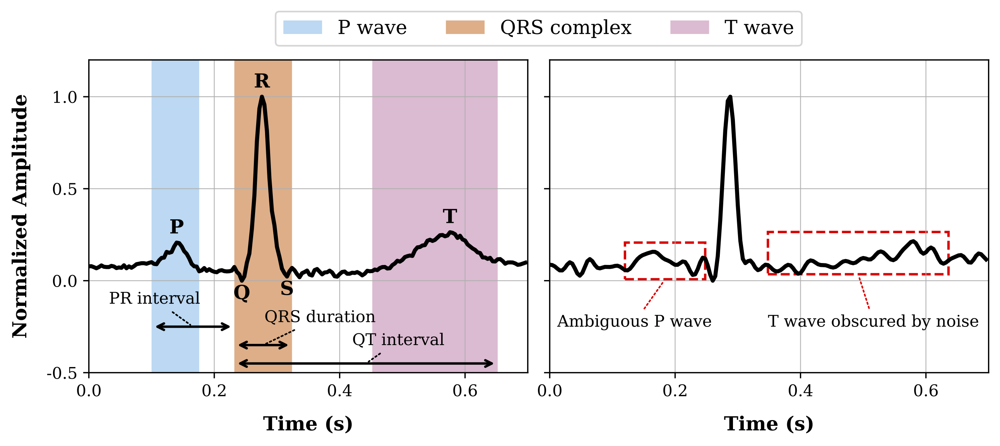
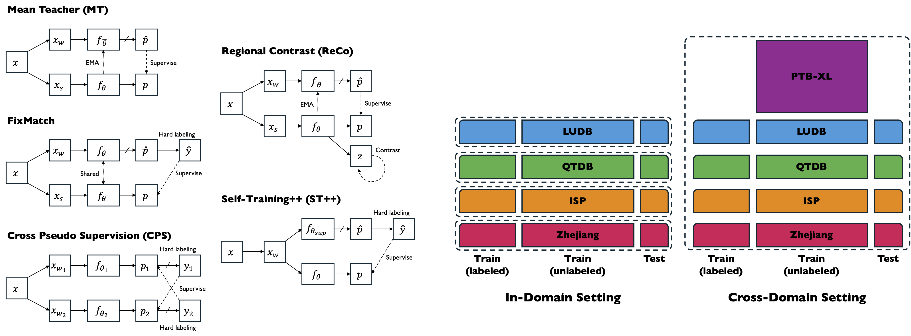
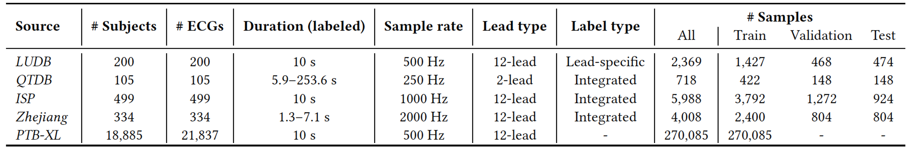

# SemiSegECG: A Multi-Dataset Benchmark for Semi-Supervised Semantic Segmentation in ECG Delineation
This is an official repository of __SemiSegECG__, <ins>a systematic multi-dataset benchmark suite for ECG delineation</ins>. 

## Table of Contents
- [__Overview__](#overview)
- [__Features__](#features)
- [__Installation__](#installation)
- [__Benchmark Data__](#benchmark-data)
  - [__Data Overview__](#data-overview)
  - [__Download__](#download)
  - [__Access Link__](#access-link)
- [__Usage__](#usage)
- [__License__](#license)
- [__Citation__](#citation)

## Overview

<div align="center">
  
</div>

ECG delineation (i.e., ECG segmentation) is a fundamental step in ECG monitoring, dividing signals into key waveform features. While deep learning models have shown effectiveness in this task, they are limited by scarce labeled data requiring labor-intensive, expert-driven annotation. Semi-supervised learning can bridge this gap by leveraging abundant unlabeled ECG data. SemiSegECG provides a standardized benchmark suite for ECG delineation.

<div align="center">
  
</div>

__SemiSegECG__ consists of 5 public ECG databases (4 labeled, 1 unlabeled) and 5 representative vision-based semi-supervised semantic segmentation algorithms. Two benchmarking scenarios are considered:
- __In-domain setting__: A typical use case where both labeled and unlabeled data come from the same source
- __Cross-domain setting__: A more practical scenario involving heterogeneous sources across labeled, unlabeled, and potential test data

Please see [our paper](https://arxiv.org/pdf/2507.18323) for detailed information and benchmarking results.


## Features
- __Datasets__
  - [_LUDB_](https://www.physionet.org/content/ludb/1.0.1/) (labeled)
  - [_QTDB_](https://physionet.org/content/qtdb/1.0.0/) (labeled)
  - [_ISP_](https://zenodo.org/records/14679837) (labeled)
  - [_Zhejiang_](https://figshare.com/collections/An_Novel_ECG_Database_to_Identify_Outflow_Tract_Origins_of_Idiopathic_Ventricular_Arrhythmia/4668086/2) (labeled)
  - [_PTB-XL_](https://physionet.org/content/ptb-xl/1.0.1/) (unlabeled)
- __Algorithm Implementations__
  - [Mean Teacher (MT)](https://arxiv.org/pdf/1703.01780)
  - [FixMatch](https://arxiv.org/pdf/2001.07685)
  - [Cross Pseudo Supervision (CPS)](https://arxiv.org/pdf/2106.01226)
  - [Regional Contrast (ReCo)](https://arxiv.org/pdf/2104.04465)
  - [Self-Training++ (ST++)](https://arxiv.org/pdf/2106.05095)
- __Networks__
  - ResNet
  - Vision Transformer
  - FCN
- __Augmentations__
  - Random resized crop
  - Amplitude scale
  - Flip
  - Mask (e.g., cutout) 
  - Baseline shift
  - Noise (e.g., powerline, sine, square, gaussian)


## Installation
### Requirements
- python 3.9
- einops 0.6.0
- mergedeep 1.3.4
- numpy 1.21.6
- pandas 1.4.2
- pytorch 1.11.0
- PyYAML 6.0
- scipy 1.8.1
- tensorboard
- torchmetrics 1.5.2
- tqdm
- wfdb

### Commands
```bash
semi-seg-ecg$ conda create -n semi_seg_ecg python=3.9
semi-seg-ecg$ conda activate semi_seg_ecg
semi-seg-ecg$ pip install -r requirements.txt
```

## Benchmark Data
### Data Overview

<div align="center">
  
</div>

<sup>"12-lead": standard limb (I, II, III, aVR, aVL, aVF) + precordial (V1–V6) leads; "6-lead": limb-only; "2-lead": two selected leads (e.g., MLII); "lead-specific": separate onset-offset per lead; "integrated": single annotation across all leads.</sup>

### Download
We recommend using [`gdown`](https://github.com/wkentaro/gdown) command for the installation.

```bash
semi-seg-ecg$ gdown $FILE_ID -O $OUT_PATH
```
- `$FILE_ID`: __Google Drive__ file ID, which can be extracted from the shareable links.<br>
  (e.g. `https://drive.google.com/file/d/$FILE_ID`)
- `$OUT_PATH`: the desired output path or directory.

- Example:
  ```bash
  semi-seg-ecg$ gdown 1qPAEmilpbSfCArhfDDKl1Vrqn4j89ZWK -O data/
  semi-seg-ecg$ gdown 1vWSola1ySAt5XI8jMoG6ZPAwcFn8OAjP -O index/
  semi-seg-ecg$ unzip -q data/ludb.zip -d data/
  semi-seg-ecg$ unzip -q index/ludb.zip -d index/
  semi-seg-ecg$ rm data/ludb.zip
  semi-seg-ecg$ rm index/ludb.zip
  ```

### Access Link
__ECG waveforms & annotations__
| **Database** | **File ID**                              | **Download** |
|--------------|-------------------------------------------|--------------|
| *LUDB*       | 1qPAEmilpbSfCArhfDDKl1Vrqn4j89ZWK         | [link](https://drive.google.com/file/d/1qPAEmilpbSfCArhfDDKl1Vrqn4j89ZWK) |
| *QTDB*       | 1PjoRMw7ZpzmwPWAZq8e7KXpAOVBwucrZ         | [link](https://drive.google.com/file/d/1PjoRMw7ZpzmwPWAZq8e7KXpAOVBwucrZ) |
| *ISP*        | 1NUPQ5rhGvkFPIYNvXz5nWBk8_wF0EIFE         | [link](https://drive.google.com/file/d/1NUPQ5rhGvkFPIYNvXz5nWBk8_wF0EIFE) |
| *Zhejiang*   | 1EYTOrK5GhskO8ulwJyea6UKCFG4-UZ21         | [link](https://drive.google.com/file/d/1EYTOrK5GhskO8ulwJyea6UKCFG4-UZ21) |
| *PTB-XL*     | 1zs8g5ivGImTctPYyfBx14b1JZhe0u53w         | [link](https://drive.google.com/file/d/1zs8g5ivGImTctPYyfBx14b1JZhe0u53w) |

__Index__
| **Dataset** | **File ID** | **Download** |
|-------------|-------------|--------------|
| **In-domain setting** |||
| *LUDB*      | 1vWSola1ySAt5XI8jMoG6ZPAwcFn8OAjP | [link](https://drive.google.com/file/d/1vWSola1ySAt5XI8jMoG6ZPAwcFn8OAjP) |
| *QTDB*      | 1VCpOrIC0B5V57Jc7b-kR26-T22Bq__nQ | [link](https://drive.google.com/file/d/1VCpOrIC0B5V57Jc7b-kR26-T22Bq__nQ) |
| *ISP*       | 1V2_YoolEnK8I8jRd0W8rixv1xHDBdvyd | [link](https://drive.google.com/file/d/1V2_YoolEnK8I8jRd0W8rixv1xHDBdvyd) |
| *Zhejiang*  | 1Q8zTQcZDZToaN6L-BLOBoNEJol89xgNW | [link](https://drive.google.com/file/d/1Q8zTQcZDZToaN6L-BLOBoNEJol89xgNW) |
| **Cross-domain setting** |||
| *Merged*    | 1B_uCeuVS-eyUjWZ85AswGLn6wwFnfFvd | [link](https://drive.google.com/file/d/1B_uCeuVS-eyUjWZ85AswGLn6wwFnfFvd) |

**Note**: For detailed data preprocessing and generation of dataset split indices (i.e., train/validation/test), please refer to the code repository [here](https://github.com/jeonghwaimnida/Delineation_dataset).

## Usage
```bash
semi-seg-ecg$ bash scripts/train.sh --help
Usage: bash scripts/train.sh [options]
Options:
  --master_port PORT               Master port (default=12345)
  --gpus GPUS                      GPU indices (default=0)
  -f, --config_path PATH           Path of config file (required)
  -o, --override_config_path PATH  Path of override config file (optional)
  --output_dir PATH                Output directory (optional)
  --exp_name NAME                  Experiment name (optional)
  --resume PATH                    Path of checkpoint to resume (optional)
  --start_epoch EPOCH              Start epoch (optional)
  -h, --help                       Print help
```
Please check the YAML files in the `configs` directory. These are the configurations used for the benchmarking experiments.

- Example:
  ```bash
  semi-seg-ecg$ bash scripts/train.sh \
  > -f ../configs/base/fixmatch.yaml \
  > -o ../configs/bench/ludb/1over16.yaml
  ```

## License
© VUNO Inc. All rights reserved.
 
This repository contains code developed at VUNO Inc. by its employees as part of their official duties.
Do not distribute, modify, or use this code outside the scope permitted by the license without explicit permission from VUNO.

## Citation

If you find this work or code is helpful in your research, please cite:
```
@article{park2025multi,
  title={SemiSegECG: A Multi-Dataset Benchmark for Semi-Supervised Semantic Segmentation in ECG Delineation},
  author={Park, Minje and Lim, Jeonghwa and Yu, Taehyung and Joo, Sunghoon},
  journal={arXiv preprint arXiv:2507.18323},
  year={2025}
}
```
